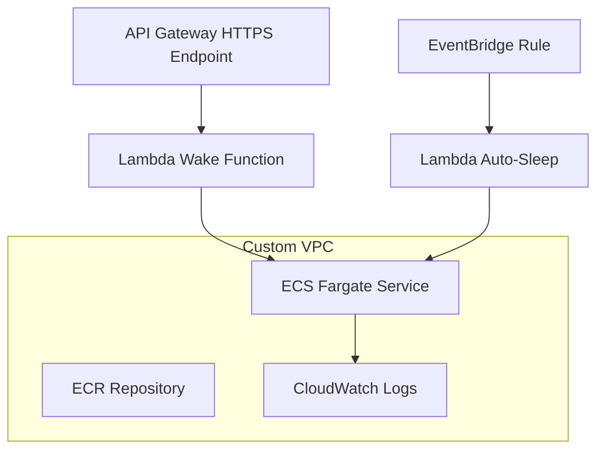

# 🚀 Docker ECS Deployment Demo

This repository demonstrates how to run a **production-like app on AWS ECS Fargate without ALB** and keep costs minimal by using a **Wake/Sleep pattern** with Lambda + API Gateway.

---

## 📂 Repository Structure

```
.
├── app/                  # Node.js demo application (Express server with UI, metrics, logs)
│   ├── Dockerfile
│   └── src/server.js
│
├── infra/                # Terraform IaC for ECS, ECR, VPC, Lambda Wake/Sleep, API Gateway
│   ├── main.tf
│   ├── variables.tf
│   ├── outputs.tf
│   └── ...
│
├── wake/                 # Lambda function to "wake up" ECS service
│   └── lambda_function.py
│
├── autosleep/            # Lambda function to automatically stop idle ECS service
│   └── auto_sleep.py
│
├── .github/workflows/    # GitHub Actions CI/CD pipelines
│   ├── ci.yml            # Build & Push to ECR
│   ├── cd.yml            # Terraform Apply + Deploy/Destroy
│   └── ops.yml           # Wake/Sleep ECS Service
│
└── README.md             # Documentation
```

---

## ⚙️ Workflows (CI/CD)

```mermaid
graph TD
  A1[CI — Build & Push to ECR (ci.yml)] --> A2[CD — Terraform Apply + Deploy/Destroy (cd.yml)]
  A2 --> A3[OPS — Wake/Sleep ECS Service (ops.yml)]
```

- **CI**: builds and pushes Docker image to ECR on each push.  
- **CD**: provisions/updates ECS + infra with Terraform.  
- **OPS**: provides manual wake/sleep operations via GitHub Actions.

---

## 🌐 Application Features

- Node.js + Express demo app with:
  - Health endpoint (`/health`)
  - Metrics endpoint (`/api/metrics`)
  - Logs (JSON + SSE streaming)
  - Simple UI (dark/light theme, live logs, action buttons)

- ECS Fargate service with **desiredCount = 0** by default (sleeping).  
- Lambda + API Gateway **Wake URL** to scale service from 0 → 1 automatically.  
- Auto-Sleep Lambda scales back to 0 after inactivity.

---

## 🏗️ Infrastructure Overview



- **ECS Fargate** runs containerized app (ARM64, Node.js).  
- **ECR** stores Docker images.  
- **CloudWatch Logs** stores app + infra logs.  
- **API Gateway + Lambda** handles wake-up.  
- **EventBridge + Lambda** enforces auto-sleep after N minutes.

---

## DNS & Public Access

The project is exposed via a custom domain:

🔗 **https://ecs-demo.online**

- The domain is managed via **Namecheap** and delegated to **Route 53** hosted zone.  
- The root (`ecs-demo.online`) is mapped to the **API Gateway (Wake URL)** via Route 53 alias record.  
- First visit → API Gateway triggers Lambda wake-up → ECS Fargate task starts.  
- After ~30–60s cold start the container becomes reachable on the public IP, and user is redirected to the running service.  

> ⚠️ If the service is **asleep** (scaled to 0), you may need to reload once and wait for the wake-up screen to complete.

---

## 🧑‍💻 Usage

```bash
# Build and push image
docker build -t ecs-demo-app .
docker tag ecs-demo-app:latest <ACCOUNT_ID>.dkr.ecr.us-east-1.amazonaws.com/ecs-demo-app:latest
docker push <ACCOUNT_ID>.dkr.ecr.us-east-1.amazonaws.com/ecs-demo-app:latest

# Deploy infra (Terraform)
cd infra
terraform init
terraform apply -auto-approve

# Get wake URL
terraform output wake_url
```

---

## 📜 License

MIT — use freely for demo/learning purposes.
