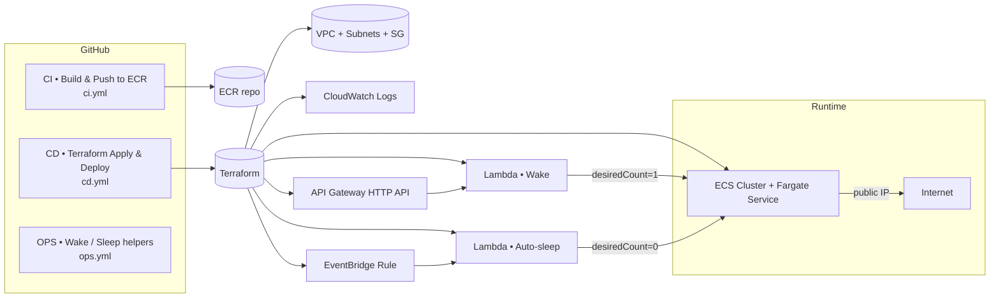
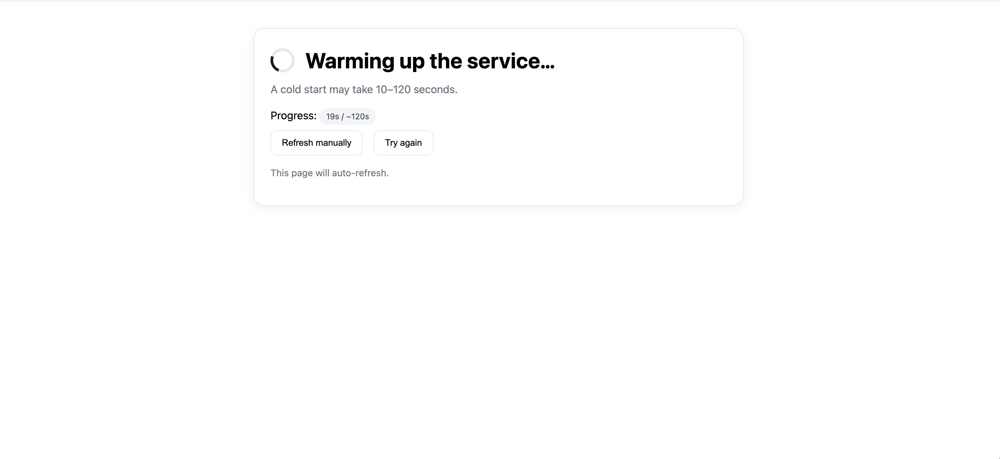
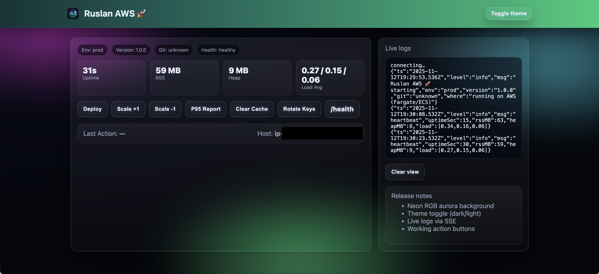
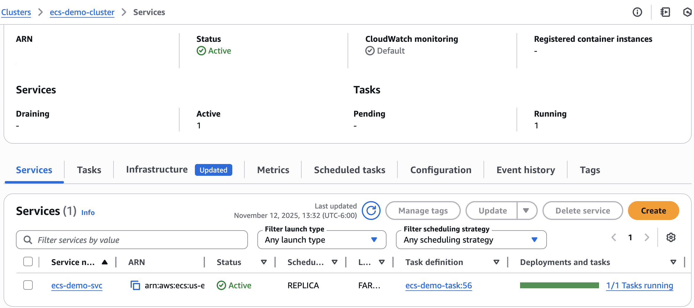
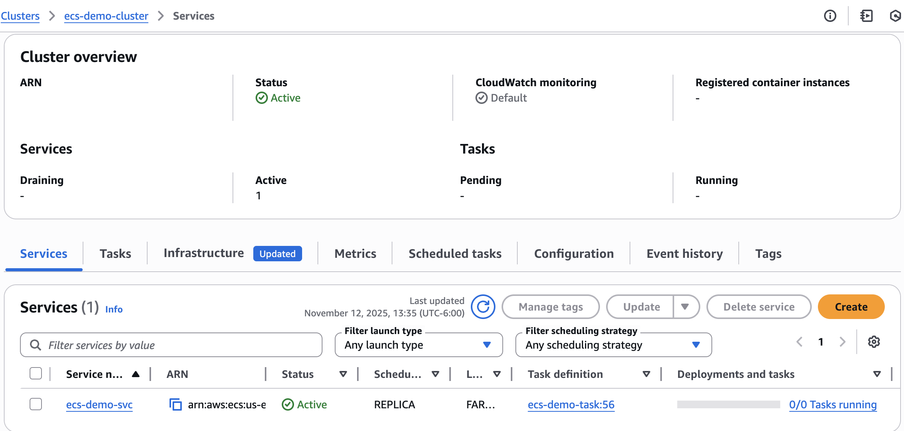
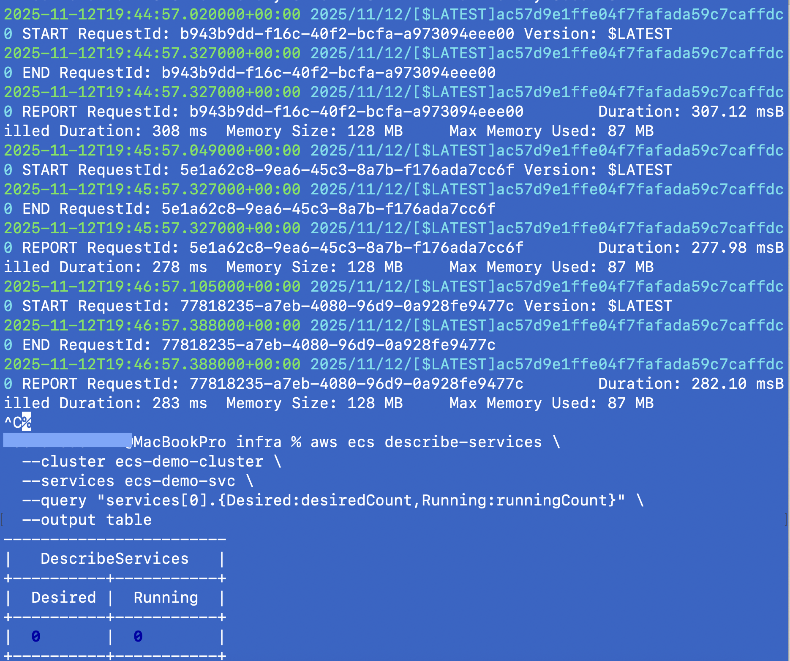

# 🚀 Docker-ecs-deployment

A fully automated scale-to-zero ECS Fargate deployment with on-demand wake-up and automatic sleep, built for minimal cost and clean architecture.

- The app normally runs at $0 (`desiredCount=0`)
- Hitting https://api.ecs-demo.online triggers the Wake Lambda via API Gateway
- Lambda scales the ECS service to 1 and redirects the user to the running task’s public IP
- After inactivity, the Auto-Sleep Lambda returns the service back to 0

No ALB. No Route 53 hosted zone. No persistent compute.
Only API Gateway + Lambda + ECS → optimized for the lowest possible AWS bill.

---

## 📦 What you get

- **Node.js demo app** (Express) with a slick UI (dark/light), live logs (SSE), and simple actions.
- **ECR** repository to store your images.
- **VPC** with two public subnets, **security group**, **ECS cluster**, **Fargate service**.
- **Wake API**: API Gateway → Lambda (Python) that scales the service to **1** and redirects to the task IP.
- **Auto-sleep**: EventBridge rule → Lambda (Python) that scales the service to **0** after inactivity.
- **GitHub Actions** (3 workflows):
  - **CI**: Build & push to ECR.
  - **CD**: Terraform apply / destroy and roll service to a new image.
  - **OPS**: Wake or Sleep the service on demand.

> ✅ **Minimal state**: All Terraform is in `infra/main.tf` (no split files).

---

## 🧭 Repository structure

```text

docker-ecs-deployment
├── app/
│   ├── Dockerfile
│   ├── package.json
│   ├── package-lock.json
│   └── src/
│       └── server.js
│
├── wake/                              # Wake Lambda source (Python)
│
├── infra/                             # All Terraform code
│   ├── backend.tf                     # S3 + DynamoDB remote state backend
│   ├── providers.tf                   # AWS provider + required versions
│   ├── variables.tf                   # Input variables
│   ├── locals.tf                      # Derived locals (paths, names)
│   ├── networking.tf                  # VPC, subnets, security group
│   ├── ecr.tf                         # ECR repository
│   ├── ecs.tf                         # ECS cluster, task, service
│   ├── logs.tf                        # CloudWatch logs setup
│   ├── wake.tf                        # Wake Lambda + API Gateway
│   ├── main.tf                        # High-level module wiring
│   └── outputs.tf                     # Terraform outputs
│
├── docs/
│   └── readme-screenshots/            # Images used inside README
│
├── scripts/
│   ├── build-push.sh                  # Build & push Docker image to ECR
│   └── get-public-url.sh              # Helper script to fetch live task URL
│
├── make_zips.sh                       # Bundles Lambdas into infra/*.zip
└── README.md

```


---

## 🏗️ Architecture (high-level)



---


## ⚙️ Prerequisites

- **AWS account**, IAM role for GitHub OIDC (see `cd.yml`).
- **S3** bucket + **DynamoDB** table for Terraform backend (already referenced in `main.tf`):
  - Bucket: `docker-ecs-deployment`
  - Table: `docker-ecs-deployment` (primary key: `LockID` as a string)
- **ECR** repository name (default): `ecs-demo-app`
- **Terraform** 1.6+ (locally or via GitHub Actions)
- **Docker** (to build/push images locally if needed)

---

## 🔧 First-time setup (local)

1) Create Lambda zips:
```bash
./make_zips.sh
# → creates: infra/wake.zip and infra/sleep.zip
```

2) Initialize Terraform backend & providers:
```bash
cd infra
terraform init -input=false
```

3) Apply infrastructure (creates VPC, ECS, ECR, Lambdas, API GW):
```bash
terraform apply -auto-approve -input=false
```

4) Build and push the image (local flow, optional — or use CI):
```bash
# login to ECR
aws ecr get-login-password --region us-east-1 \
| docker login --username AWS --password-stdin <ACCOUNT>.dkr.ecr.us-east-1.amazonaws.com

# build & push
docker build -t ecs-demo-app:latest ./app
docker tag ecs-demo-app:latest <ACCOUNT>.dkr.ecr.us-east-1.amazonaws.com/ecs-demo-app:latest
docker push <ACCOUNT>.dkr.ecr.us-east-1.amazonaws.com/ecs-demo-app:latest
```

5) Wake the service in browser and you’ll be redirected to the running task:
```
https://ecs-demo.online
```

---

## 🤖 GitHub Actions

### CI — Build & Push to ECR (`.github/workflows/ci.yml`)
- Builds `./app` into an image and pushes to ECR.
- Outputs the full image URL `ACCOUNT_ID.dkr.ecr.us-east-1.amazonaws.com/ecs-demo-app:<tag>`.

### CD — Terraform Apply + Deploy/Destroy (ECS) (`.github/workflows/cd.yml`)
- **Apply**: `terraform apply` + roll service to the image tag (or `latest`).
- **Destroy**: scales service to 0, then `terraform destroy`.  
- Prints the final **wake URL** and the **domain**: `https://ecs-demo.online`.

### OPS — Wake/Sleep helpers (`.github/workflows/ops.yml`)
- `wake`: calls the Wake URL (API GW) — useful for checks or previews.
- `sleep`: sets `desiredCount=0` immediately.

> All jobs use GitHub OIDC to assume **`github-actions-ecs-role`** in your AWS account.

---

## 🔍 Variables (Terraform)

| Name                 | Type   | Default        | Description                                   |
|----------------------|--------|----------------|-----------------------------------------------|
| `project_name`       | string | `ecs-demo`     | Prefix for AWS resource names                 |
| `region`             | string | `us-east-1`    | AWS region                                    |
| `vpc_cidr`           | string | `10.20.0.0/16` | VPC CIDR                                      |
| `public_subnets`     | list   | `["10.20.1.0/24", "10.20.2.0/24"]` | Two public subnets                 |
| `desired_count`      | number | `0`            | 0 = idle, 1 = running                         |
| `task_cpu`           | string | `256`          | Task CPU                                      |
| `task_memory`        | string | `512`          | Task memory                                   |
| `app_port`           | number | `80`           | Container port                                |
| `ecr_repo_name`      | string | `ecs-demo-app` | ECR repo name                                 |
| `enable_wake_api`    | bool   | `true`         | Create Wake Lambda + API GW                   |
| `enable_auto_sleep`  | bool   | `true`         | Create Auto-sleep Lambda + EventBridge rule   |
| `sleep_after_minutes`| number | `5`            | When to scale to 0                            |

> Lambda env `WAIT_MS` in `main.tf` controls the **warm-up budget** shown on the waiting page.

---

## 📸 Screenshots — Wake / Sleep Workflow

### 1️⃣ Service Warming Up
The initial wake sequence — the API Gateway triggers the **Lambda "Wake"**, which scales the ECS service from `desiredCount=0` to `1`.


---

### 2️⃣ Application Running
The application is now live and serving requests inside the **ECS Fargate** task.  
Live metrics (uptime, memory, load average) are streamed to the UI dashboard.


---

### 3️⃣ ECS Service — Active
AWS Console confirms that **1/1 tasks** are running and the service is fully active within the ECS cluster.  
The cluster status is **Active**, no tasks are pending.


---

### 4️⃣ ECS Service — Autosleep Triggered
After idle timeout, the **Auto-Sleep Lambda** scales the ECS service back down to `desiredCount=0`.  
This ensures cost-efficient operation by shutting down inactive containers.


---

### 5️⃣ CloudWatch Logs — Autosleep Event
CloudWatch logs confirm the autosleep action with the payload:  
`{"ok": true, "stopped": true}` — indicating the ECS service has successfully stopped.


---

## 🔒 Why the redirect uses HTTP

After waking the ECS task, the Lambda redirects to the task’s public IP, which can only serve HTTP.
HTTPS is terminated at API Gateway, but the container itself has no TLS certificate and no static endpoint.
Adding HTTPS on the container requires an ALB, which costs $16–$20/mo — breaking the project’s scale-to-zero design.

---

## 💰 Cost notes

- **Idle:** ECS/Fargate = $0 (service sleeps at `desiredCount=0`).

You only pay small amounts for:

- Lambda invocations (wake + auto-sleep)
- API Gateway HTTP API (low cost)
- CloudWatch Logs (minimal retention)
- S3 + DynamoDB for Terraform backend
- **Active:** cost of a single Fargate task (0.25 vCPU / 0.5 GB), only while running

---

## 🆘 Troubleshooting

- **Waiting page loops forever**  
  Increase `WAIT_MS` to `120000–180000` ms.

- **Redirect shows private IP**  
  Ensure public subnets and `assign_public_ip = "ENABLED"`.

- **Custom domain returns 403/404**  
  API Gateway → Custom domain → Mapping must be `$default`.

- **Certificate stuck in Pending validation**  
  Validate DNS CNAME propagation.

- **Destroy fails**  
  Remove API Mapping → Remove Custom Domain → run `terraform destroy` again.

---

## 🧹 Cleanup

```bash
# scale down first (optional)
aws ecs update-service --cluster ecs-demo-cluster --service ecs-demo-svc --desired-count 0 --region us-east-1

# destroy infra
cd infra
terraform destroy -auto-approve -input=false
```

---

## 🧾 License

Released under the **MIT License** — feel free to use, fork, and learn from it.  
© Ruslan Dashkin (🚀Ruslan AWS)
Branding name “🚀Ruslan AWS” and related visuals are protected; commercial reuse or rebranding without permission is prohibited.
