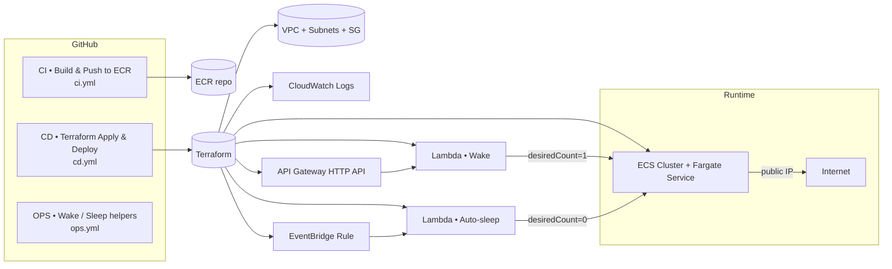
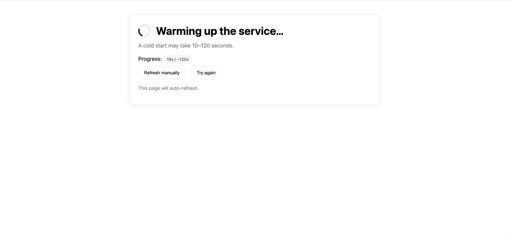
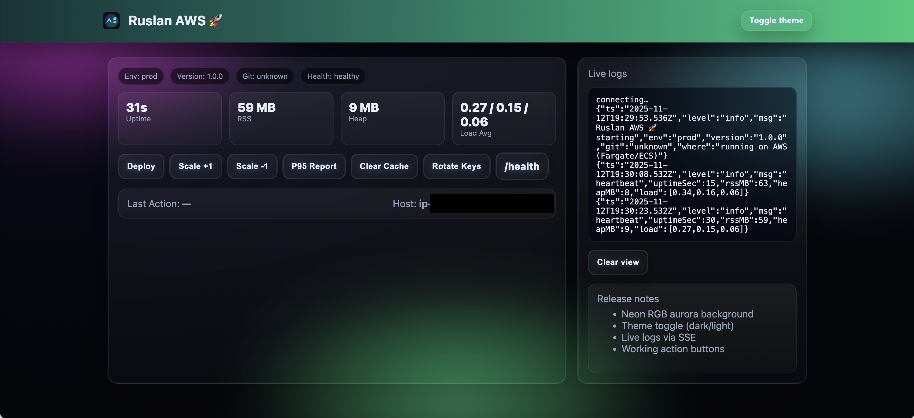
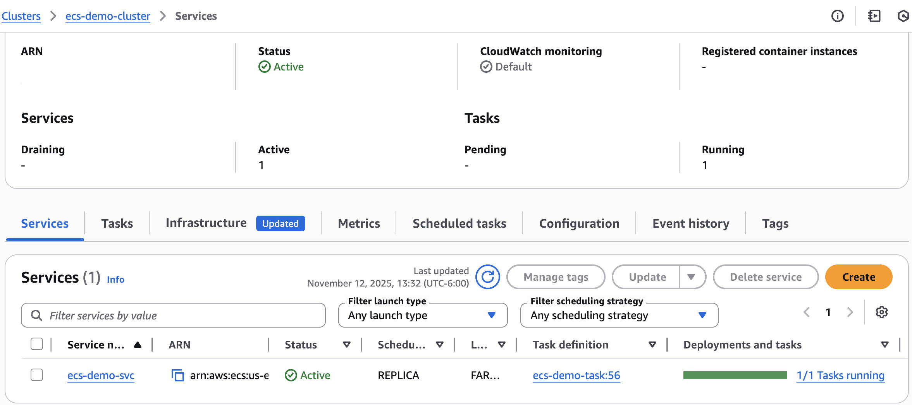
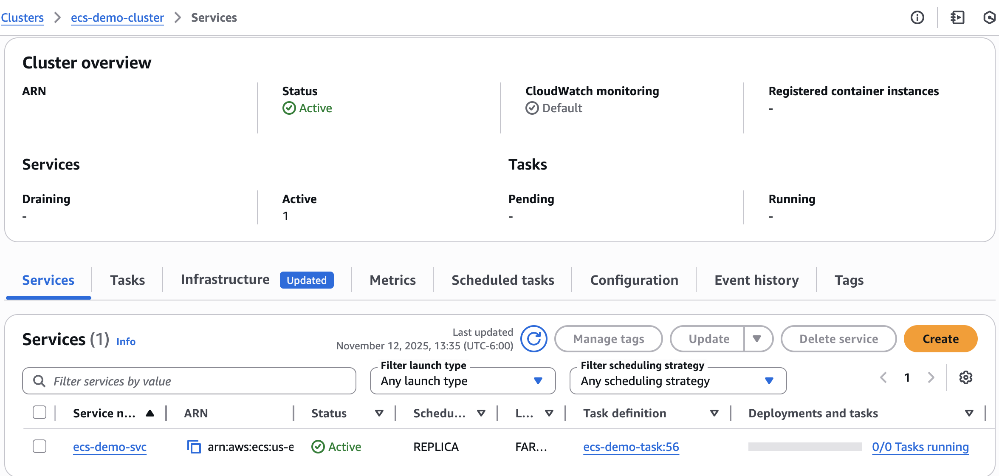
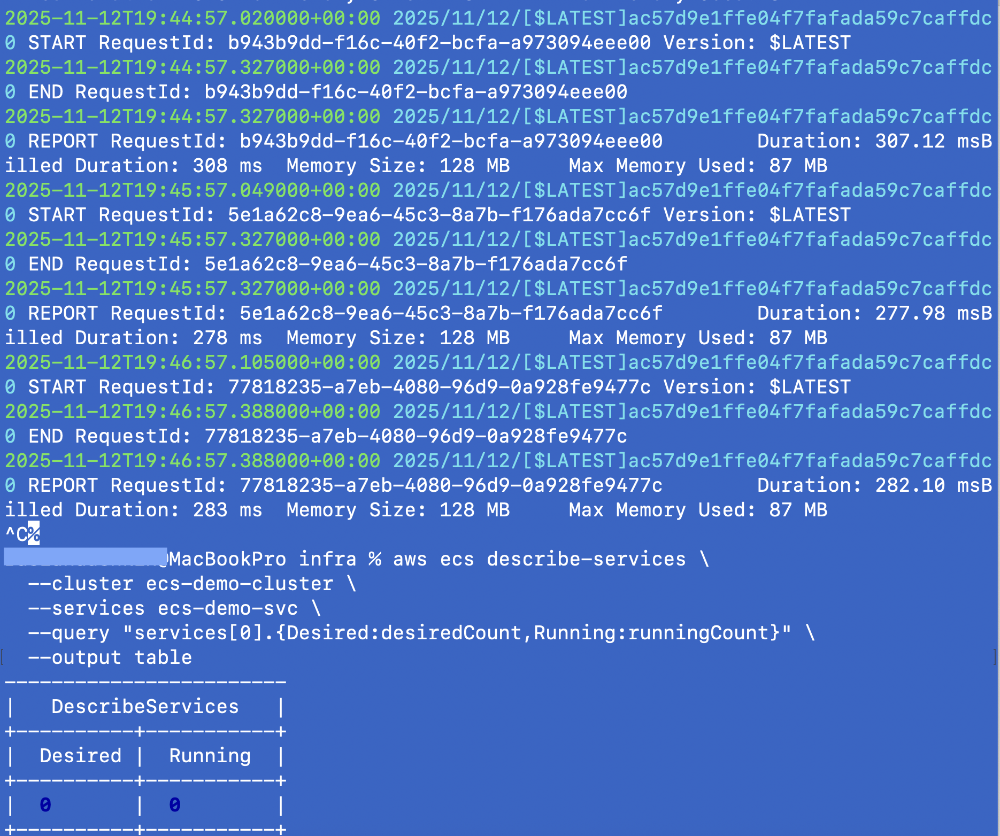

# Docker ECS Deployment — Fargate + On-Demand Provisioning

<p align="center">
  
  
  
  
  
</p>


**Wait Page:** https://api.ecs-demo.online  

I built this project as a fully automated, scale-to-zero ECS Fargate environment with on-demand provisioning and automatic shutdown.

The service runs at $0 by default (`desiredCount=0`).  
When a request hits the Wait Page, API Gateway triggers the Wake Lambda, which scales the ECS service to 1 task and redirects the user to the task’s public IP.  
After a defined idle period, the Auto-Sleep Lambda scales the service back to `0`.

There is no ALB, no project-created Route 53 hosted zone, and no persistent compute.  
The stack works directly on the API Gateway endpoint, with a custom domain as an optional layer.

The architecture is intentionally minimal: API Gateway + Lambda + ECS.  
The goal is deterministic on-demand startup, clean infrastructure design, and the lowest possible AWS cost without sacrificing clarity or control.

---

## **Architecture Overview**


```mermaid
flowchart LR
  subgraph GH[GitHub]
    CI[CI • Build & Push to ECR<br/>ci.yml]
    CD[CD • Terraform Apply & Deploy<br/>cd.yml]
    OPS[OPS • Wake / Sleep helpers<br/>ops.yml]
  end

  CI --> ECR[(ECR repo)]
  CD --> TF[(Terraform)]
  TF --> VPC[(VPC + Subnets + SG)]
  TF --> ECS[ECS Cluster + Fargate Service]
  TF --> CWL[CloudWatch Logs]
  TF --> LWA[Lambda • Wake]
  TF --> LAS[Lambda • Auto-sleep]
  TF --> APIGW[API Gateway HTTP API]
  TF --> EVB[EventBridge Rule]

  APIGW --> LWA
  EVB --> LAS
  LWA -->|desiredCount=1| ECS
  LAS -->|desiredCount=0| ECS

  subgraph Runtime
    ECS -->|public IP| Internet
  end
```
---

## OpenAPI-Driven Wake API

The wake HTTP API is defined using an **OpenAPI 3** specification located in `infra/api/openapi-wake.yaml`.

Terraform consumes this spec to configure the **API Gateway HTTP API**, including routes, methods, and Lambda integration.  
The OpenAPI file is version-controlled alongside the infrastructure code and validated in CI.

Both the Terraform configuration and the OpenAPI spec are scanned by **Checkov**, ensuring consistent policy enforcement across infrastructure and API definitions.

This approach keeps the API contract explicit, reviewable in pull requests, and reusable across different clients or environments.

---

## Prerequisites

- AWS account (region `us-east-1` recommended)
- S3 bucket and DynamoDB table for Terraform remote backend  
  (or use the configuration in `infra/backend.tf`)
- IAM role configured for GitHub OIDC with permissions for ECR, ECS, Lambda, and Logs
- Terraform ≥ 1.6
- AWS CLI configured locally
- GitHub repository with Actions enabled

---

## **Quick Start**

### **Local Terraform Deployment**
```bash
cd infra

terraform init
terraform plan -out=tfplan
terraform apply -auto-approve tfplan
```

### CI/CD Deployment (Recommended)

Deployment is fully automated through GitHub Actions.

When changes are pushed to `main`:

- CI builds the Docker image from `./app`
- The image is tagged with the **commit SHA** (immutable tag strategy)
- The image is pushed to **Amazon ECR**

The CD workflow then:

- Runs `terraform apply`
- Registers a new ECS Task Definition referencing the SHA image
- Updates the ECS service to the exact image version produced by CI
- Waits until the ECS service reaches a **stable** state

This guarantees deterministic deployments and removes any dependency on mutable tags like `latest`.

---

## Key AWS Services Used

| Service            | Role in the Architecture |
|--------------------|--------------------------|
| **API Gateway**    | Public HTTP endpoint defined via OpenAPI, invokes the Wake Lambda |
| **AWS Lambda**     | Implements wake and auto-sleep logic (scales ECS service up and down) |
| **Amazon ECS**     | Runs the containerized application as a Fargate service |
| **AWS Fargate**    | Serverless compute layer for containers (no EC2 management) |
| **Amazon ECR**     | Stores versioned Docker images (SHA-tagged) |
| **Amazon VPC**     | Provides networking: public subnets, Internet Gateway, security groups |
| **CloudWatch Logs**| Centralized logs for Lambda, API Gateway, and ECS |
| **EventBridge**    | Scheduled trigger for the auto-sleep Lambda |
| **S3 + DynamoDB**  | Remote Terraform state backend with locking |

---

## Wake / Sleep Lifecycle

The service operates in true **scale-to-zero** mode.  
When idle, the ECS service remains at `desiredCount = 0` and consumes no compute resources.

### Wake Flow

Client → API Gateway → Wake Lambda → `ecs:UpdateService(desiredCount=1)`  
→ Fargate task starts → Lambda waits for `RUNNING`  
→ Browser redirects to the task public IP.

### Sleep Flow

EventBridge (runs every 1 minute)  
→ Auto-Sleep Lambda checks activity  
→ If idle, scales the service back to `desiredCount=0`.

---

## On-Demand Startup Challenge

When scaling from `desiredCount=0`, early requests sometimes returned **HTTP 500**.

**Cause**

API Gateway forwarded traffic before the Fargate task was fully running and had obtained a public IP.  
Startup time (~40 seconds) created a race condition during warm-up.

**Fix**

Implemented ECS task status polling inside the Wake Lambda, verified the `RUNNING` state, resolved the task public IP, and introduced a controlled warm-up window (`WAIT_MS`).

**Result**

Deterministic startup behavior with reliable redirects and no premature failures.

---

## Application Layer

- **Runtime:** Node.js (Express-based HTTP service)
- **Source directory:** `./app`
- **Container image:** built from `./app/Dockerfile` and pushed to Amazon ECR via CI
- **Deployment model:** single-container ECS Fargate task
- **Port configuration:** application listens on `APP_PORT` (default: `80`)
- **Frontend features:**
  - Light / dark theme toggle
  - Real-time log streaming via Server-Sent Events (SSE)
  - Simple endpoints to generate traffic and simulate activity

---

### Wait Page & Frontend Flow

- **Entry point:**  
  The user accesses the public endpoint (API Gateway custom domain or default invoke URL).

- **Warm-up phase:**  
  The Wake Lambda returns a lightweight HTML response while the ECS service scales from `desiredCount=0` to `1`.

- **Readiness check:**  
  The Lambda polls ECS until the task reaches `RUNNING` state and the container becomes reachable.

- **Redirect:**  
  Once ready, the browser is redirected to the task’s public IP on `APP_PORT` (default `80`).

- **Timeout protection:**  
  If the task does not become ready within `WAIT_MS`, the request fails gracefully instead of redirecting prematurely.

---

## **Project Structure**

```text
docker-ecs-deployment
├── app/               # Node.js app (Express)
├── wake/              # Wake Lambda (Python)
├── autosleep/         # Auto-sleep Lambda (Python)
├── build/             # Built Lambda ZIPs (Terraform-generated)
├── infra/             # All Terraform infrastructure
│   └── api/openapi-wake.yaml   # OpenAPI spec for the wake HTTP API
├── docs/              # Architecture, ADRs, runbooks
├── .github/           # CI/CD workflows + templates
├── README.md
└── LICENSE
```

---

## Documentation

**Docs:** [All Docs](./docs/) | [Architecture](./docs/architecture.md) | [Cost](./docs/cost.md) | [Configuration](./docs/configuration.md) | [Operational Model](./docs/operational-model.md) | [ADRs](./docs/adr/) | [Runbooks](./docs/runbooks/)

---

## **Common Terraform & AWS CLI Commands**

### Terraform Lifecycle
```bash
terraform init
terraform plan -out=tfplan
terraform apply -auto-approve tfplan
terraform destroy -auto-approve
```

### AWS CLI Checks
```bash
aws ecs describe-services --cluster ecs-demo-cluster --services ecs-demo-svc --region us-east-1
aws logs tail /aws/lambda/ecs-demo-wake --follow --region us-east-1
aws logs tail /aws/lambda/ecs-demo-autosleep --follow --region us-east-1
aws events list-rules --name-prefix ecs-demo-autosleep --region us-east-1
aws ecs list-tasks --cluster ecs-demo-cluster --region us-east-1
aws ecs describe-tasks --cluster ecs-demo-cluster --tasks <TASK_ID> --region us-east-1
```
---

## **Secrets Management**

- Secrets are **not hardcoded** in Terraform or source code.
- No plaintext credentials are stored in GitHub Actions.
- Authentication uses **GitHub OIDC** → IAM role → temporary AWS credentials.
- ECS tasks do not require static secrets (no DB, no external API tokens).
- Lambda functions use only environment variables that contain **non-sensitive** values:
  - `CLUSTER_NAME`
  - `SERVICE_NAME`
  - `SLEEP_AFTER_MINUTES`
  - `WAIT_MS`

### If secrets are needed in the future
Use:
- **SSM Parameter Store (SecureString)** for configuration  
- **AWS Secrets Manager** for rotating credentials  
- Access via:  
  - IAM role attached to the Lambda  
  - IAM role attached to the ECS task  

This keeps the project **fully keyless**, secure, and aligned with AWS best practices.
  
---

## GitHub Actions Automation

- **CI (`ci.yml`)**  
  Builds Docker image, tags with commit SHA, pushes to ECR.

- **CD (`cd.yml`)**  
  Assumes AWS role via OIDC, runs `terraform apply/destroy`, registers new task definition, updates ECS service, waits for stability.

- **OPS (`ops.yml`)**  
  Manual helpers for wake (API call) and sleep (`desiredCount=0`).

All workflows use OIDC (no static AWS keys), least-privilege IAM, and deterministic SHA-based deployments.

---

### **Where We Consciously Accept Trade-Offs**

- **No ALB (HTTP-only after wake)**  
  Redirect goes to the task’s public IP over HTTP — avoids ~$20/mo ALB cost.

- **Public-only subnets**  
  No NAT Gateway (saves ~$32–$40/mo), but tasks must access the internet directly.

- **Single-AZ architecture**  
  Lower cost and faster provisioning, but not multi-AZ fault tolerant.

- **Lambda-based warm-up logic**  
  Slightly longer wake times vs. always-on compute — acceptable for scale-to-zero.

- **Minimal logging retention**  
  Keeps CloudWatch bill low, but long-term log history is not preserved.

Each trade-off is intentional to support a **near-zero-cost, on-demand environment** suitable for demos, learning, and interviews.

---

## **Screenshots**

###  Service Warming Up
The initial wake sequence — the API Gateway triggers the **Lambda "Wake"**, which scales the ECS service from `desiredCount=0` to `1`.


---

###  Application Running
The application is now live and serving requests inside the **ECS Fargate** task.  
Live metrics (uptime, memory, load average) are streamed to the UI dashboard.


---

###  ECS Service — Active
AWS Console confirms that **1/1 tasks** are running and the service is fully active within the ECS cluster.  
The cluster status is **Active**, no tasks are pending.


---

###  ECS Service — Autosleep Triggered
After idle timeout, the **Auto-Sleep Lambda** scales the ECS service back down to `desiredCount=0`.  
This ensures cost-efficient operation by shutting down inactive containers.


---

###  CloudWatch Logs — Autosleep Event
CloudWatch logs confirm the autosleep action with the payload:  
`{"ok": true, "stopped": true}` — indicating the ECS service has successfully stopped.


---

## Summary

This project implements a scale-to-zero ECS Fargate architecture with deterministic on-demand startup.

The service remains at `desiredCount=0` when idle and provisions compute only when traffic arrives.  
Wake and sleep logic is implemented through Lambda, with infrastructure fully managed via Terraform and deployed through GitHub Actions.

The result is a minimal, reproducible, and cost-efficient platform that demonstrates controlled lifecycle management of containerized workloads on AWS.

---

## License

This project is released under the MIT License.

See the `LICENSE` file for details.