#  Docker-ecs-deployment

<p align="center">
  
  
  
  
  
  
  
  
</p>

<p align="center">
  
  
  
  
  
</p>


**Wait Page:** [https://api.ecs-demo.online](https://api.ecs-demo.online)  

A **fully automated, scale-to-zero ECS Fargate deployment** with **on-demand wake-up** and **automatic sleep**, built for **minimal cost** and **clean architecture**.

- The app normally runs at **$0** (`desiredCount=0`)
- A request to the **Wait Page** triggers **API Gateway → Wake Lambda**
- The **Wake Lambda** scales the ECS service to **1 task** and redirects the user to the task’s **public IP**
- After inactivity, the **Auto-Sleep Lambda** scales the service back to **0**

No **ALB**. No *project-created* Route 53 hosted zone — the stack works fully on the
default API Gateway invoke URL.  
A custom domain is **optional** and not required for deployment. No **persistent compute**.  
Only **API Gateway + Lambda + ECS** → optimized for the **lowest possible AWS bill**.

---
## **Architecture Overview**

```mermaid
flowchart LR
  subgraph GH[GitHub]
    CI[CI • Build & Push to ECR<br/>ci.yml]
    CD[CD • Terraform Apply & Deploy<br/>cd.yml]
    OPS[OPS • Wake / Sleep helpers<br/>ops.yml]
  end

  CI --> ECR[(ECR repo)]
  CD --> TF[(Terraform)]
  TF --> VPC[(VPC + Subnets + SG)]
  TF --> ECS[ECS Cluster + Fargate Service]
  TF --> CWL[CloudWatch Logs]
  TF --> LWA[Lambda • Wake]
  TF --> LAS[Lambda • Auto-sleep]
  TF --> APIGW[API Gateway HTTP API]
  TF --> EVB[EventBridge Rule]

  APIGW --> LWA
  EVB --> LAS
  LWA -->|desiredCount=1| ECS
  LAS -->|desiredCount=0| ECS

  subgraph Runtime
    ECS -->|public IP| Internet
  end
```


---

## **Prerequisites**

- AWS account (**us-east-1** recommended)
- S3 bucket + DynamoDB table for Terraform backend  
  (or use the backend config in `infra/backend.tf`)
- IAM role for GitHub OIDC (minimal permissions for ECR, ECS, Lambda)
- Terraform ≥ 1.6 and AWS CLI installed locally
- GitHub repository with Actions enabled

---

## **Quick Start**

### **Local Terraform Deployment**
```bash
cd infra

terraform init
terraform plan -out=tfplan
terraform apply -auto-approve tfplan
```

### **CI/CD Deployment (Recommended)**

- Push to `main`  
  → CI builds the Docker image and tags it with the **commit SHA**
- CI pushes the immutable SHA-tagged image to **Amazon ECR**
- CD workflow automatically:
  - Applies Terraform
  - Registers a new ECS Task Definition
  - Updates the ECS service to the **exact SHA image**
  - Waits until the service becomes **stable**

---

## **Key AWS Services Used**

| Service          | Purpose                                                         |
|------------------|-----------------------------------------------------------------|
| **API Gateway**  | Entry point for wake requests → triggers the Wake Lambda        |
| **AWS Lambda**   | Wake and Auto-Sleep logic (scale ECS to 1 → back to 0)          |
| **Amazon ECS**   | Fargate service running the Node.js application                 |
| **AWS Fargate**  | Serverless compute for containers (no EC2, scale-to-zero ready) |
| **Amazon ECR**   | Storage for Docker container images                             |
| **Amazon VPC**   | Public-only networking, subnets, Internet Gateway               |
| **CloudWatch**   | Logs for Lambda, API Gateway, ECS                               |
| **EventBridge**  | Scheduler that triggers Auto-Sleep every minute                 |
| **S3 + DynamoDB**| Terraform backend (state + locking)                             |

---

## **Wake/Sleep Lifecycle**

The environment remains **asleep (desiredCount=0)** when idle and wakes **only on demand**.

- **Wake flow:**  
  Client → API Gateway → Wake Lambda → `ecs:UpdateService` → Fargate task starts → user redirected to task public IP

- **Sleep flow:**  
  EventBridge (every 1 minute) → Auto-Sleep Lambda → checks ECS task activity → scales service back to `desiredCount=0`

This ensures **near-zero cost** while still providing a fully functional on-demand application.

---

## **Default Timings (Current Configuration)**

- **Wake delay:** ~40–60 seconds  
  Time required for Fargate to pull the image, start the task, and pass health checks.

- **Warm-up budget (`WAIT_MS`):** 120,000 ms  
  How long the Wake Lambda waits before redirecting the user.

- **Idle timeout (`sleep_after_minutes`):** 5 minutes  
  After this period with no requests, the Auto-Sleep Lambda scales the service to `desiredCount=0`.

- **Auto-sleep check frequency:** every 1 minute  
  Driven by the EventBridge scheduled rule.

---

## **Application Layer**

- **Runtime:** Node.js 18 (Express)
- **Source path:** `./app` (single-container web app)
- **Container image:** built from `./app/Dockerfile` and pushed to ECR
- **UI features:**
  - Dark / light theme toggle
  - Live logs via Server-Sent Events (SSE)
  - Simple actions to simulate load and activity
- **Port:** listens on `APP_PORT` (default `80`) inside the Fargate task

---

###  Wait Page & Frontend Flow

- **Entry point:** user opens the public endpoint (API Gateway custom domain or invoke URL).
- **Warm-up page:** the Wake Lambda responds with a lightweight HTML page that:
  - Shows that the ECS service is starting.
  - Waits while the task transitions from `PENDING` to `RUNNING`.
- **Redirect target:** once the Fargate task is healthy, the page redirects the browser to:
  - The task **public IP** over HTTP.
  - The container’s application port (`APP_PORT`, default `80`).
- **Timeout behavior:** if the task does not become ready within the configured warm-up budget (`WAIT_MS`), the page shows an error instead of redirecting.

---

## **Project Structure**
```text

docker-ecs-deployment
├── app/               # Node.js app (Express)
├── wake/              # Wake Lambda (Python)
├── autosleep/         # Auto-sleep Lambda (Python)
├── build/             # Built Lambda ZIPs (Terraform-generated)
├── infra/             # All Terraform infrastructure
├── docs/              # Architecture, ADRs, runbooks
├── .github/           # CI/CD workflows + templates
├── README.md
└── LICENSE

```
**Full detailed structure:** see [`docs/architecture.md`](./docs/architecture.md)

---

##  Documentation

- **Architecture:** [`docs/architecture.md`](docs/architecture.md)
- **SLO:** [`docs/slo.md`](docs/slo.md)
- **Monitoring:** [`docs/monitoring.md`](docs/monitoring.md)
- **Cost Analysis:** [`docs/cost.md`](docs/cost.md)
- **Threat Model:** [`docs/threat-model.md`](docs/threat-model.md)

### ADRs
- **ADR-001:** [`OIDC vs Access Keys`](docs/adr/ADR-001-oidc-vs-access-keys.md)
- **ADR-002:** [`Single-AZ vs Multi-AZ`](docs/adr/ADR-002-single-az-vs-multi-az.md)
- **ADR-003:** [`API Gateway as Public Entrypoint`](docs/adr/ADR-003-api-gateway-as-public-entrypoint.md)
- **ADR-004:** [`ECS Fargate as Compute`](docs/adr/ADR-004-ecs-fargate.md)
- **ADR-005:** [`Auto-Sleep via Lambda + EventBridge`](docs/adr/ADR-005-autosleep-lambda-eventbridge.md)

### Runbooks
- **Wake failures:** [`RUNBOOK-wake-failures.md`](docs/runbooks/RUNBOOK-wake-failures.md)
- **Auto-sleep issues:** [`RUNBOOK-autosleep-issues.md`](docs/runbooks/RUNBOOK-autosleep-issues.md)
- **Deployment rollback:** [`RUNBOOK-deployment-rollback.md`](docs/runbooks/RUNBOOK-deployment-rollback.md)

### Diagrams
- **Architecture Diagram:** [`docs/diagrams/architecture.md`](docs/diagrams/architecture.md)
- **Sequence Diagram:** [`docs/diagrams/sequence.md`](docs/diagrams/sequence.md)
---

## **Environment Variables / Parameters**

| Name                  | Location             | Description                                                        |
|-----------------------|----------------------|--------------------------------------------------------------------|
| `APP_PORT`            | Terraform → Task Env | Port the Node.js app listens on (default: `80`)                    |
| `WAIT_MS`             | Lambda (Wake)        | Warm-up wait budget before redirecting to the task’s public IP     |
| `CLUSTER_NAME`        | Lambda (Both)        | Name of the ECS cluster                                            |
| `SERVICE_NAME`        | Lambda (Both)        | Name of the ECS service                                            |
| `SLEEP_AFTER_MINUTES` | Lambda (Auto-Sleep)  | Idle timeout before scaling ECS back to `desiredCount=0`           |
| `ECR_REPOSITORY`      | Terraform Locals     | Name of ECR repository storing the app image                       |
| `AWS_REGION`          | All Components       | AWS region used across the stack (default: `us-east-1`)            |

---

## **Cost Optimization Principles**

- **Scale-to-zero by default**  
  The ECS service stays at `desiredCount=0` when idle, consuming no compute cost.

- **Wake only when needed**  
  The Wake Lambda starts the task on demand instead of running workloads 24/7.

- **Eliminate ALB costs**  
  No Application Load Balancer is used (saves ~$16–$20/month).  
  API Gateway + Lambda handle the wake flow instead.

- **Use public-only subnets**  
  No NAT Gateway is provisioned (saves ~$32–$40/month).

- **Small Fargate task size**  
  The app uses 0.25 vCPU / 0.5 GB RAM — the cheapest Fargate tier.

- **Short idle timeout (5 min)**  
  Auto-Sleep minimizes “active task time” to reduce compute charges.

- **Minimal logging footprint**  
  CloudWatch log retention is configured to keep costs near zero.

- **Terraform backend in S3 + DynamoDB**  
  Both backend services cost pennies per month, even with frequent updates.

These principles keep the environment **near-zero cost** without sacrificing functionality.

---

## **Common Terraform & AWS CLI Commands**

### Terraform Lifecycle
```bash
terraform init
terraform plan -out=tfplan
terraform apply -auto-approve tfplan
terraform destroy -auto-approve
```

### AWS CLI Checks
```bash
aws ecs describe-services --cluster ecs-demo-cluster --services ecs-demo-svc --region us-east-1
aws logs tail /aws/lambda/ecs-demo-wake --follow --region us-east-1
aws logs tail /aws/lambda/ecs-demo-autosleep --follow --region us-east-1
aws events list-rules --name-prefix ecs-demo-autosleep --region us-east-1
aws ecs list-tasks --cluster ecs-demo-cluster --region us-east-1
aws ecs describe-tasks --cluster ecs-demo-cluster --tasks <TASK_ID> --region us-east-1
```
---

## **Secrets Management**

- Secrets are **not hardcoded** in Terraform or source code.
- No plaintext credentials are stored in GitHub Actions.
- Authentication uses **GitHub OIDC** → IAM role → temporary AWS credentials.
- ECS tasks do not require static secrets (no DB, no external API tokens).
- Lambda functions use only environment variables that contain **non-sensitive** values:
  - `CLUSTER_NAME`
  - `SERVICE_NAME`
  - `SLEEP_AFTER_MINUTES`
  - `WAIT_MS`

### If secrets are needed in the future
Use:
- **SSM Parameter Store (SecureString)** for configuration  
- **AWS Secrets Manager** for rotating credentials  
- Access via:  
  - IAM role attached to the Lambda  
  - IAM role attached to the ECS task  

This keeps the project **fully keyless**, secure, and aligned with AWS best practices.

---

### **Workflow Hygiene & Security**

- All GitHub Actions authenticate using **OIDC** — no long-lived AWS keys.
- Workflows run with **minimal permissions** (`id-token: write`, `contents: read`).
- Terraform CI runs only on **pull requests**, never on pushes to main.
- CI/CD jobs are isolated:
  - **CI** builds and pushes Docker images.
  - **CD** deploys infrastructure and updates ECS.
  - **OPS** provides manual wake/sleep helpers.
- Each workflow has **concurrency groups** to prevent overlapping runs.
- Logs are kept lightweight to avoid leaking environment details.
- No secrets are stored in repository, workflows, or Terraform state.
- IAM roles used by CI/CD follow **least privilege**, scoped only to:
  - ECR (push/pull)
  - ECS (update service)
  - Lambda (invoke)
  - CloudWatch logs
  
---

## **GitHub Actions Automation**

- **App CI (`ci.yml`)**
  - Builds the Docker image from `./app`
  - Tags the image using the **commit SHA** (immutable tag strategy)
  - Pushes the image to **Amazon ECR** — no `latest`, no overwrites

- **Terraform CI (`terraform-ci.yml`)**
  - Runs on **pull requests** to validate infrastructure changes
  - Executes:
    - `terraform fmt -check`
    - `terraform init -backend=false`
    - `terraform validate`
    - `tflint`
    - `tfsec`
    - `checkov`
  - Fails fast if there are formatting, linting, or security issues

- **CD — Deploy / Destroy (`cd.yml`)**
  - Assumes AWS role via **GitHub OIDC**
  - Runs `terraform apply` or `terraform destroy`
  - Registers a new **ECS Task Definition**
  - Updates the **ECS service** to the selected image tag
  - Waits until the service becomes **stable**
  - Deploys the exact **SHA-tagged image** produced by CI  
    (ECR tag immutability ensures deterministic deployments)

- **OPS — Wake / Sleep (`ops.yml`)**
  - Provides manual operational helpers:
    - `wake` → calls the **Wake API** (API Gateway) to start the service
    - `sleep` → scales the ECS service to `desiredCount=0`
  - Useful for manual checks, demos, and scheduled actions

- **Shared properties**
  - All workflows use **OIDC-based authentication** (no static AWS keys)
  - Permissions are scoped to **least privilege** (ECR, ECS, Lambda, logs)
  - Concurrency controls prevent overlapping deployments
  - Pipelines are designed to be **interview-friendly** and **production-style**

---

## **Quick Reference**

- **Wait Page:** https://api.ecs-demo.online  
- **AWS Region:** us-east-1  
- **ECR Repository:** ecs-demo-app  
- **Cluster:** ecs-demo-cluster  
- **Service:** ecs-demo-svc  
- **Task Size:** 0.25 vCPU / 0.5 GB RAM  
- **Idle Timeout:** 5 minutes (`SLEEP_AFTER_MINUTES` — Terraform variable & Lambda env)  
- **Warm-up Budget:** 120s (`WAIT_MS`)  
- **Public Endpoint:** redirects to the Fargate task’s public IP  
- **Terraform Backend:** S3 + DynamoDB (project-specific names)  
- **Compute Mode:** Scale-to-zero (desiredCount=0 by default)

---

## **Security Posture & Static Analysis**

- CI enforces formatting, validation, linting, and security scanning  
  (`terraform fmt`, `validate`, **tflint**, **tfsec**, **checkov**)
- All AWS access uses **GitHub OIDC** — no long-lived secrets
- IAM follows **least privilege** for ECS, ECR, Lambda, Logs, and API Gateway
- No sensitive data in GitHub, Terraform state, or Lambda/ECS env vars
- Network footprint minimized: public-only subnets, no NAT Gateway, no ALB
- Build artifacts isolated (`build/`), no compiled code stored in repo

---

### **Tools & What They Cover**

- **terraform fmt**  
  Ensures consistent formatting across all Terraform files.

- **terraform validate**  
  Verifies that the Terraform configuration is syntactically correct.

- **tflint**  
  Lints Terraform code, catches mistakes, invalid arguments, deprecated attributes.

- **tfsec**  
  Static analysis for Terraform security issues (IAM, networking, encryption).

- **checkov**  
  Deep policy-as-code scanner covering misconfigurations, compliance, CIS benchmarks.

- **GitHub OIDC**  
  Secure authentication for CI/CD without storing AWS keys.

- **AWS CLI**  
  Operational checks: ECS state, Lambda logs, EventBridge rules, task details.

These tools together cover **formatting**, **syntax**, **linting**, **security**, and **runtime validation** of the entire stack.

---

### **Where We Consciously Accept Trade-Offs**

- **No ALB (HTTP-only after wake)**  
  Redirect goes to the task’s public IP over HTTP — avoids ~$20/mo ALB cost.

- **Public-only subnets**  
  No NAT Gateway (saves ~$32–$40/mo), but tasks must access the internet directly.

- **Single-AZ architecture**  
  Lower cost and faster provisioning, but not multi-AZ fault tolerant.

- **Lambda-based warm-up logic**  
  Slightly longer wake times vs. always-on compute — acceptable for scale-to-zero.

- **Minimal logging retention**  
  Keeps CloudWatch bill low, but long-term log history is not preserved.

Each trade-off is intentional to support a **near-zero-cost, on-demand environment** suitable for demos, learning, and interviews.

---

## **Terraform CI**

### **Overview**

Terraform CI runs automatically on every pull request that touches:

- `infra/**`
- `.github/workflows/terraform-ci.yml`
- `.tflint.hcl`
- `.checkov.yml`

It verifies that **formatting, validation, linting, and security checks all pass**
across multiple Terraform versions **before** changes reach `main`.

---

### **Terraform Versions Tested**

| **Terraform version** |
|-----------------------|
| 1.6.6                 |
| 1.8.5                 |
| 1.9.5                 |

Each version runs the full set of format, validation, lint, and security checks.

---

### **CI Updates**

Terraform CI now adds a short report to GitHub Actions after every run.  
The report shows:

- which Terraform versions were tested  
- results of format and validate checks  
- results from TFLint, Checkov, and tfsec  
- links to detailed logs  

This makes reviewing changes easier and faster.

---

### **Checks Included**

- **Formatting**
  - `terraform fmt -check`
- **Core validation**
  - `terraform init -backend=false`
  - `terraform validate`
- **Static analysis**
  - `tflint --recursive`
- **Security scanning**
  - `tfsec` (via `aquasecurity/tfsec-action`)
  - `checkov` (via `.checkov.yml` policy file)

If any of these steps fail for any Terraform version, the CI check on the pull request is marked as failed.

---

### **Files Involved**

- `.github/workflows/terraform-ci.yml` – CI workflow definition  
- `.tflint.hcl` – TFLint configuration  
- `.checkov.yml` – Checkov policy and skipped rules for this demo design  
- `infra/` – Terraform root module and all infrastructure code

---

## **Screenshots**

###  Service Warming Up
The initial wake sequence — the API Gateway triggers the **Lambda "Wake"**, which scales the ECS service from `desiredCount=0` to `1`.


---

###  Application Running
The application is now live and serving requests inside the **ECS Fargate** task.  
Live metrics (uptime, memory, load average) are streamed to the UI dashboard.


---

###  ECS Service — Active
AWS Console confirms that **1/1 tasks** are running and the service is fully active within the ECS cluster.  
The cluster status is **Active**, no tasks are pending.


---

###  ECS Service — Autosleep Triggered
After idle timeout, the **Auto-Sleep Lambda** scales the ECS service back down to `desiredCount=0`.  
This ensures cost-efficient operation by shutting down inactive containers.


---

###  CloudWatch Logs — Autosleep Event
CloudWatch logs confirm the autosleep action with the payload:  
`{"ok": true, "stopped": true}` — indicating the ECS service has successfully stopped.


---

### **Summary**

This project delivers a **fully automated, on-demand ECS Fargate environment** that operates at **near-zero cost**.  
It wakes within about a minute when accessed, sleeps when idle, and uses a minimal, secure, and production-style architecture with Terraform and GitHub Actions.

AWS components, IAM roles, CI/CD, and Lambdas are all designed around:  
- **Simplicity**  
- **Security**  
- **Cost efficiency**  
- **Reproducibility**  
- **Portfolio-ready clarity**

Ideal for learning, demos, interviews, and real-world DevOps practice — all without paying for idle compute.

---

## **Author & Portfolio**

Portfolio website: https://rusets.com  
More real AWS, DevOps, IaC, and automation projects by **Ruslan AWS**.

---

## License

Released under the MIT License.  
See the LICENSE file for full details.

Branding name “🚀 Ruslan AWS” and related visuals may not be reused or rebranded without permission.